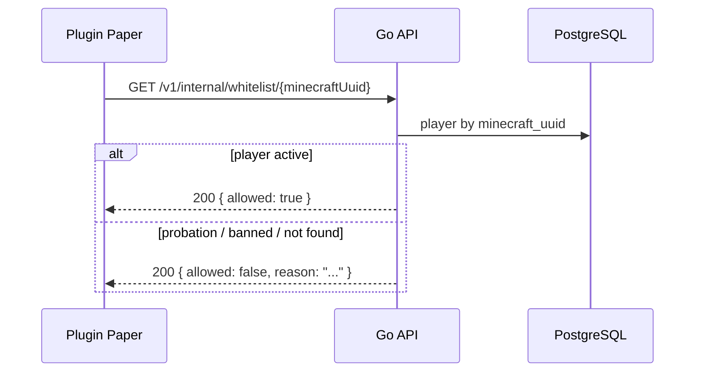
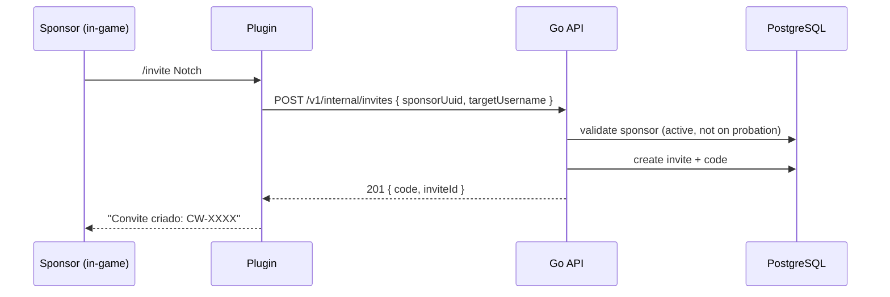

# Arquitetura de referência — Go backend (padrão Lingo)

Documento vivo para projetos Minecraft / CampusWorld. Descreve o **padrão arquitetural** usado em [`lingo/backend`](../Lokra/lingo/backend) e como aplicá-lo ao **CampusWorld backend**.

---

## Índice

1. [Por que este padrão](#1-por-que-este-padrão)
2. [Visão geral do padrão Lingo](#2-visão-geral-do-padrão-lingo)
3. [Camadas e regras de dependência](#3-camadas-e-regras-de-dependência)
4. [Layout de pastas](#4-layout-de-pastas)
5. [HTTP, erros e contratos](#5-http-erros-e-contratos)
6. [Banco de dados e migrações](#6-banco-de-dados-e-migrações)
7. [Wiring, middleware e config](#7-wiring-middleware-e-config)
8. [Testes, Docker e CI](#8-testes-docker-e-ci)
9. [O que não fazer](#9-o-que-não-fazer)
10. [CampusWorld — plano do backend](#10-campusworld--plano-do-backend)
11. [Próximos passos](#11-próximos-passos)

---

## 1. Por que este padrão

O backend do Lingo resolve bem os problemas que o CampusWorld também terá:

| Necessidade CampusWorld | Como o padrão responde |
|-------------------------|------------------------|
| API rápida para plugin Minecraft | Go, binário único, baixa latência |
| Domínio complexo (trust, convites, claims) | Camadas claras: handler → service → repository |
| Erros estáveis para plugin e frontend | `apperrors` com códigos únicos por ramo |
| Evolução por fases | Migrações SQL versionadas + módulos por domínio |
| VPS pequena | Pouca RAM, deploy simples |
| Multi-servidor Minecraft | `server_id` no domínio; API como fonte da verdade |

**Referência:** [`lingo/backend/docs/ARCHITECTURE.md`](../Lokra/lingo/backend/docs/ARCHITECTURE.md)

---

## 2. Visão geral do padrão Lingo

### 2.1 Dois runtimes (Lingo)

```text
Cliente (Next.js)
       │
       ▼
  Go API (server/)     ← REST /v1, auth, CRUD, regras síncronas
       │
       ├─ PostgreSQL   ← fonte da verdade
       └─ Redis        ← fila de jobs
              │
              ▼
       Python worker/   ← jobs pesados (LLM, NLP, batches)
       scheduler
```

**Princípio central:** Go é o **dono do estado online** — o que o utilizador vê após uma ação síncrona já está persistido na transação da API.

### 2.2 CampusWorld — simplificação na Fase 1

Na Fase 1, o CampusWorld **não precisa de Python worker**. Tudo cabe no Go:

```text
Plugin Paper ──HTTP──► Go API (server/)
Frontend     ──HTTP──►       │
                             ▼
                        PostgreSQL
```

Redis e worker entram na **Fase 4+** (auditoria em volume, analytics, backups assíncronos).

```text
Fase 4+:
  Go API ──enqueue──► Redis ──► worker (Go ou Python)
                                    │
                                    ├─ audit batch ingest
                                    ├─ rollback rebuild
                                    └─ analytics / grafos
```

---

## 3. Camadas e regras de dependência

Padrão fixo, documentado no ADR 0001 do Lingo:

```text
handler  →  service  →  repository
   │            │
   │            └─ Redis, filas, orquestração (quando existir)
   └─ HTTP parse, auth de transporte, JSON
```

| Camada | Responsabilidade | Proibido |
|--------|------------------|----------|
| **Handler** | Parse path/query/body, extrair identidade (JWT / API key), chamar service, `WriteError` | GORM, regras de negócio |
| **Service** | Validações, transações, trust score, convites, Redis | `http.Request`, status codes |
| **Repository** | Queries GORM/Postgres | `apperrors`, Redis, HTTP |

**Regra:** repository **nunca** importa service nem handler.

### Erros (`internal/apperrors`)

- Um `Code*` por ramo de falha — grepável, estável para cliente
- Mensagem pública em **inglês**
- `Kind` → HTTP status centralizado

Exemplo de nomenclatura:

```text
PLAYER_GET_V1_SERVICE_PLAYER_NOT_FOUND
INVITE_CREATE_V1_SERVICE_SPONSOR_ON_PROBATION
WHITELIST_CHECK_V1_SERVICE_PLAYER_BANNED
```

### Modelos (`internal/models/`)

Structs GORM com UUID como PK, tags JSON em camelCase (`minecraftUuid`, `trustScore`), colunas em snake_case no Postgres.

---

## 4. Layout de pastas

### 4.1 Padrão Lingo (referência)

```text
backend/
├── docs/
│   ├── ARCHITECTURE.md
│   ├── SERVER_LAYERS_AND_ERRORS.md
│   └── adr/
├── migrations/              # 000001_init.sql, 000002_...
├── server/                  # Go HTTP API
│   ├── cmd/
│   │   ├── server/main.go   # entry point + wiring manual
│   │   └── migrate/main.go  # CLI de migrações
│   ├── internal/
│   │   ├── httpserver/      # handlers + router (centralizado)
│   │   ├── middleware/
│   │   ├── apperrors/
│   │   ├── models/
│   │   ├── migrate/
│   │   ├── platform/postgres/
│   │   ├── {domain}/
│   │   │   ├── repository/
│   │   │   └── service/
│   │   └── ...
│   ├── go.mod
│   └── Dockerfile
├── docker-compose.yml
└── .env.example
```

### 4.2 CampusWorld backend (plano)

```text
faculdade/backend/
├── README.md
├── docs/
│   ├── ARCHITECTURE.md          # adaptação CampusWorld (link para este doc)
│   ├── SERVER_LAYERS_AND_ERRORS.md
│   ├── PHASES.md
│   └── adr/
│       ├── 0001-go-gorm-layers.md
│       └── 0002-plugin-api-key-auth.md
├── migrations/
│   ├── 000001_players.sql
│   ├── 000002_invites.sql
│   └── ...
├── server/
│   ├── cmd/server/main.go
│   ├── cmd/migrate/main.go
│   ├── internal/
│   │   ├── httpserver/
│   │   │   ├── app.go
│   │   │   ├── router.go
│   │   │   ├── player.go
│   │   │   ├── invite.go
│   │   │   ├── whitelist.go
│   │   │   ├── guild.go          # Fase 2
│   │   │   ├── city.go           # Fase 3
│   │   │   ├── claim.go          # Fase 3
│   │   │   └── health.go
│   │   ├── middleware/
│   │   ├── apperrors/
│   │   ├── models/
│   │   ├── migrate/
│   │   ├── platform/postgres/
│   │   ├── auth/
│   │   │   ├── jwtissue/         # frontend (Fase 1b)
│   │   │   └── pluginkey/        # plugin Minecraft
│   │   ├── player/
│   │   │   ├── repository/
│   │   │   └── service/
│   │   ├── invite/
│   │   │   ├── repository/
│   │   │   └── service/
│   │   ├── trust/                # Fase 2
│   │   │   ├── repository/
│   │   │   └── service/
│   │   ├── guild/                # Fase 2
│   │   ├── city/                 # Fase 3
│   │   ├── claim/                # Fase 3
│   │   ├── audit/                # Fase 4
│   │   └── graph/                # Fase 7 — PageRank, comunidades
│   ├── go.mod
│   └── Dockerfile
├── docker-compose.yml
├── docker-compose.dev.yml
└── .env.example
```

**Decisões herdadas do Lingo:**

- Handlers centralizados em `httpserver/` (não co-localizados por domínio)
- Wiring manual em `main.go` — sem framework DI
- `internal/` only — nada exportável em `pkg/` por agora
- Stdlib `net/http` + `ServeMux` Go 1.22+ (`"GET /v1/players/{id}"`)

---

## 5. HTTP, erros e contratos

### Convenções

| Item | Convenção |
|------|-----------|
| Prefixo | `/v1` |
| IDs expostos | UUID (players web); Minecraft UUID como campo (`minecraftUuid`) |
| JSON | camelCase |
| Erros | `{ "code": "...", "message": "..." }` |
| Health | `GET /health`, `GET /ready` |
| OpenAPI | `GET /v1/openapi.json` (embed em `internal/openapi/`) |

### Autenticação — dois públicos

| Cliente | Mecanismo | Rotas |
|---------|-----------|-------|
| **Plugin Paper** | Header `X-Plugin-Key` + `X-Server-Id` | `/v1/internal/*`, whitelist, heartbeat |
| **Frontend web** | JWT Bearer (Fase 1b) | `/v1/players`, `/v1/invites`, perfis |
| **Admin** | JWT + role `admin` | `/v1/admin/*` |

O plugin **não usa JWT** — API key estática por instância de servidor, rotacionável.

### Rotas Fase 1 (MVP)

```text
# Público / plugin
POST   /v1/internal/players/upsert      # plugin registra/atualiza jogador online
GET    /v1/internal/whitelist/{uuid}  # plugin consulta antes do login
POST   /v1/internal/invites           # plugin: /invite <player>
GET    /v1/health
GET    /v1/ready

# Web (JWT ou público read-only)
GET    /v1/players/{id}
GET    /v1/players/{id}/invites       # árvore de convites (grafo simples)
GET    /v1/invites/{code}             # validar código de convite
POST   /v1/invites                    # criar convite (sponsor autenticado)
```

### Idempotência

Como no Lingo: `Idempotency-Key` em POSTs com efeito (`POST /v1/invites`, `POST /v1/internal/players/upsert`). Redis na Fase 2; até lá, dedup por constraint DB.

---

## 6. Banco de dados e migrações

### Estratégia (igual Lingo)

1. **SQL versionado** em `migrations/000NNN_*.sql` — produção
2. **GORM AutoMigrate** no boot — dev rápido
3. **Go é o único dono** de migrações — worker futuro só lê/escreve tabelas acordadas

### Tabelas por fase

#### Fase 1 — Fundação

```sql
-- players
id              UUID PK
minecraft_uuid  UUID UNIQUE NOT NULL
username        TEXT NOT NULL
status          TEXT NOT NULL  -- active | probation | banned
invited_by_id   UUID FK → players (nullable)
trust_score     INT DEFAULT 100
sponsor_score   INT DEFAULT 100
probation_until TIMESTAMPTZ
created_at      TIMESTAMPTZ
updated_at      TIMESTAMPTZ

-- invites
id              UUID PK
code            TEXT UNIQUE NOT NULL
sponsor_id      UUID FK → players
invited_id      UUID FK → players (nullable até aceite)
status          TEXT  -- pending | accepted | expired | revoked
created_at      TIMESTAMPTZ
accepted_at     TIMESTAMPTZ

-- servers (multi-servidor)
id              UUID PK
slug            TEXT UNIQUE  -- vanilla, pixelmon, ...
name            TEXT
created_at      TIMESTAMPTZ

-- server_players (presença por servidor)
server_id       UUID FK
player_id       UUID FK
last_seen_at    TIMESTAMPTZ
play_time_secs  BIGINT DEFAULT 0
PRIMARY KEY (server_id, player_id)
```

#### Fase 2 — Trust e guildas

```text
guilds, guild_members, trust_events, sponsor_events
```

#### Fase 3 — Território

```text
cities, claims, alliances, zones
```

#### Fase 4 — Auditoria

```text
audit_events (particionado por mês), rollbacks, rollback_items
```

---

## 7. Wiring, middleware e config

### Boot sequence (`cmd/server/main.go`)

```text
1. Ler env (DATABASE_URL, HTTP_ADDR, PLUGIN_API_KEY, ...)
2. postgres.Open(dsn)
3. migrate.Up() — SQL migrations
4. db.AutoMigrate(models...)
5. Construir repositories → services (manual)
6. httpserver.NewApp(services...)
7. middleware chain → http.Server
8. Graceful shutdown (SIGINT/SIGTERM)
```

### Middleware chain (ordem Lingo)

```text
SecurityHeaders → RequestID → AccessLog → CORS → RateLimit → mux
```

Config 100% por env — `.env.example` documenta tudo.

### Variáveis de ambiente (Fase 1)

```env
HTTP_ADDR=:8080
DATABASE_URL=postgres://...
PLUGIN_API_KEY=           # segredo compartilhado com o plugin
AUTH_JWT_SECRET=          # frontend (Fase 1b)
CORS_ALLOWED_ORIGINS=http://localhost:3000
MIGRATIONS_DIR=/migrations
SKIP_SQL_MIGRATIONS=0
```

---

## 8. Testes, Docker e CI

### Testes

| Tipo | Onde | Ferramenta |
|------|------|------------|
| Unit service | `internal/*/service/*_test.go` | `go test` + mocks de repo |
| Integration repo | `internal/*/repository/*_test.go` | testcontainers Postgres |
| HTTP handler | `internal/httpserver/*_test.go` | `httptest` |
| E2E | `tests/e2e/` | Python ou Go — fluxo plugin → API → DB |

### Docker Compose (Fase 1)

```text
services:
  postgres   # não exposto em prod
  api        # Go server, porta 8080
```

Redis entra no `docker-compose` na Fase 2 (idempotência + rate limit distribuído).

### CI

```text
.github/workflows/backend-ci.yml
  - go test ./...
  - golangci-lint
  - migrate up em Postgres efêmero
```

---

## 9. O que não fazer

| Evitar | Motivo |
|--------|--------|
| Framework HTTP pesado (Gin, Echo) | Lingo provou stdlib + ServeMux 1.22+ suficiente |
| DI framework (Wire, Fx) | Wiring manual em `main.go` é explícito e debugável |
| Lógica de negócio no handler | Dificulta testes e reuso (plugin + web) |
| GORM no handler | Quebra a regra de camadas |
| Dois donos de migração | Só Go aplica SQL |
| Microserviço por domínio | Overhead desnecessário nesta escala |
| Python no dia zero | CampusWorld Fase 1 não tem jobs pesados |
| UUID gerado pelo cliente | Sempre gerado no servidor/repository |

---

## 10. CampusWorld — plano do backend

### 10.1 Módulos de domínio

| Módulo | Fase | Responsabilidade |
|--------|------|------------------|
| `player` | 1 | CRUD, status, probation, upsert do plugin |
| `invite` | 1 | Criar/aceitar convite, código, grafo `invited_by` |
| `whitelist` | 1 | Checagem síncrona no login (via `player` service) |
| `server` | 1 | Registro de instâncias Minecraft |
| `trust` | 2 | Trust score, sponsor score, eventos |
| `guild` | 2 | Guildas, membros, líder |
| `city` | 3 | Cidades, população, fundador |
| `claim` | 3 | Claims, zonas, progressão territorial |
| `alliance` | 3 | Alianças entre guildas |
| `audit` | 4 | Ingest de eventos, investigação |
| `rollback` | 4 | Rollback por jogador + janela |
| `graph` | 7 | PageRank, comunidades, centralidade |

### 10.2 Fluxos críticos Fase 1

#### Whitelist (plugin → API)



#### Convite (in-game)



### 10.3 Trust Score v1 (Fase 2 — já planejado)

Lógica pura em `internal/trust/score.go` (como `srs/` no Lingo):

```go
// ApplyTrustDelta calcula novo score após um evento.
// Chamado pelo service, não pelo handler.
func ApplyTrustDelta(current int, event TrustEvent) int
```

Fórmula inicial (ajustável via ADR):

```text
trust = clamp(0, 100,
  100
  - confirmed_reports × 15
  - rollbacks_applied × 5
  + probation_days_without_incident × 0.5
)
```

### 10.4 Entregas por fase (backend only)

#### Fase 1 — Fundação (4–6 semanas)

- [ ] Scaffold `server/` (Go 1.22, GORM, stdlib HTTP)
- [ ] `migrations/000001_players.sql`, `000002_invites.sql`, `000003_servers.sql`
- [ ] Domínios: `player`, `invite`, `server`
- [ ] Rotas internas plugin: whitelist, upsert, create invite
- [ ] Rotas web read-only: perfil, árvore de convites
- [ ] `docker-compose.yml` (postgres + api)
- [ ] `.env.example`, README com instruções de dev
- [ ] Testes: player service, invite service, whitelist handler

**Critério de sucesso:** plugin Paper consulta whitelist e cria convite; frontend exibe perfil com grafo de convites.

#### Fase 2 — Confiança e guildas

- [ ] `trust`, `guild` modules
- [ ] Probation automática (conta nova → 7 dias)
- [ ] Sponsor score
- [ ] JWT auth para frontend
- [ ] Redis (rate limit + idempotency)

#### Fase 3 — Território

- [ ] `city`, `claim`, `alliance`
- [ ] Progressão territorial
- [ ] Zonas (enum)

#### Fase 4 — Auditoria e rollback

- [ ] `audit` ingest (batch via Redis queue)
- [ ] `rollback` engine
- [ ] Worker (Go recomendado — mesmo ecossistema, sem Python obrigatório)
- [ ] Admin routes

#### Fase 5+ — Analytics, grafos, backups

- [ ] `graph` module
- [ ] Materialized views para dashboard
- [ ] Backup jobs

### 10.5 Diferenças CampusWorld vs Lingo

| Aspecto | Lingo | CampusWorld |
|---------|-------|-------------|
| Runtimes | Go + Python | Go only (Fase 1–3); worker Go opcional (Fase 4+) |
| Auth principal | JWT (users) | API key (plugin) + JWT (web) |
| Identidade | UUID user | Minecraft UUID + UUID interno |
| Jobs assíncronos | LLM, geração | Auditoria, rollback, analytics |
| Grafo social | Não | Core feature (convites, guildas) |
| Multi-tenant | Não | `server_id` por instância Minecraft |

### 10.6 Módulo Go

```text
github.com/woragis/minecraft-campus-backend/server
```

---

## 11. Próximos passos

Ordem de implementação recomendada:

```text
1. docs/ + adr/0001 + adr/0002 no repo backend
2. server/cmd/server/main.go (boot mínimo + health)
3. migrations/000001_players.sql
4. internal/player (repository + service)
5. internal/invite (repository + service)
6. internal/httpserver (whitelist + invite handlers)
7. docker-compose.yml
8. Testes de integração
```

**Primeiro PR do backend:** scaffold + health + players + invites + whitelist. Sem guildas, sem trust, sem Redis.

---

## Referências

- [Lingo ARCHITECTURE.md](../Lokra/lingo/backend/docs/ARCHITECTURE.md)
- [Lingo SERVER_LAYERS_AND_ERRORS.md](../Lokra/lingo/backend/docs/SERVER_LAYERS_AND_ERRORS.md)
- [Lingo ADR 0001](../Lokra/lingo/backend/docs/adr/0001-gorm-postgres-handler-service-repository.md)
- [CampusWorld spec](./faculdade/CAMPUSWORLD.md)

---

*Última atualização: junho/2026*
